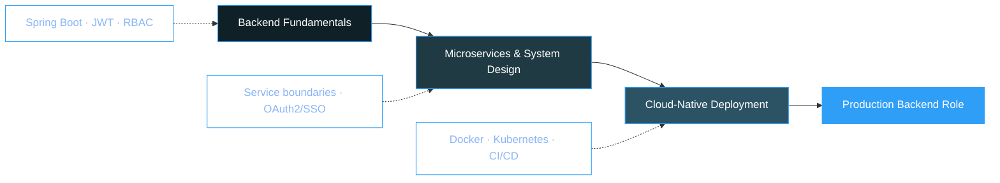

  

📍 Dindigul, Tamil Nadu, India &nbsp;·&nbsp; 🎓 ECE, PSNA College of Engineering and Technology &nbsp;·&nbsp; Class of 2027

 

`🎯 Career Goal`  Java Backend Developer at a product-based company &nbsp;|&nbsp; `💼 Status`  Open to internships & full-time roles

 

  <a href="#-about">About</a> ·
  <a href="#-tech-stack">Tech Stack</a> ·
  <a href="#-experience">Experience</a> ·
  <a href="#-projects">Projects</a> ·
  <a href="#-achievements">Achievements</a> ·
  <a href="#-certifications">Certifications</a> ·
  <a href="#-education">Education</a> ·
  <a href="#-stats">Stats</a>

 

## 🧭 About

A backend-focused engineer who likes systems that fail predictably. I build REST APIs with Java and Spring Boot, secure them properly with JWT and role-based access control, and design the data layer with PostgreSQL and MySQL to hold up under real traffic — not just pass a demo.

Currently sharpening backend fundamentals — DSA, OOP, and system design — while interning and building production-shaped side projects, including one AI-assisted system built as a national hackathon finalist.

<table>
<tr>
<td width="50%" valign="top">

**Core strengths**
- Designing REST APIs that are easy to extend and hard to misuse
- Authentication & authorization — JWT, Spring Security, RBAC, resource-ownership checks
- Relational schema design and query optimization
- Turning ambiguous requirements into a clean data model

</td>
<td width="50%" valign="top">

**Currently**
- 🔭 Deepening system design & microservices fundamentals
- 🌱 Practicing DSA for backend engineering interviews
- 🤝 Open to open-source contributions & collaboration
- ⚙️ Exploring Docker/Kubernetes for deployment workflows

</td>
</tr>
</table>

 

## 🛠 Tech Stack

<table>
<tr>
<td valign="top" width="20%"><strong>Languages</strong></td>
<td valign="top" width="80%">

</td>
</tr>
<tr>
<td valign="top"><strong>Backend</strong></td>
<td valign="top">

</td>
</tr>
<tr>
<td valign="top"><strong>Data</strong></td>
<td valign="top">

</td>
</tr>
<tr>
<td valign="top"><strong>Tooling</strong></td>
<td valign="top">

</td>
</tr>
<tr>
<td valign="top"><strong>Fundamentals</strong></td>
<td valign="top">

</td>
</tr>
<tr>
<td valign="top"><strong>AI-Assisted Dev</strong></td>
<td valign="top">

</td>
</tr>
</table>

 

## 💼 Experience

<table>
<tr><td>

**Java Full Stack Developer Intern** · Vinsup Infotech (P) Ltd
 On-site · Madurai, Tamil Nadu · Jun 2025 – Jul 2025

- Architected and delivered scalable RESTful APIs with **Java, Spring Boot, Spring Data JPA, and PostgreSQL** for a Budget Management System, powering auth, transaction tracking, and real-time dashboard analytics.
- Secured backends with **Spring Security and BCrypt** password hashing, hardened CORS policies, normalized auth inputs to eliminate login mismatches, and optimized Hibernate database mappings.
- Worked inside a **5-member Agile team** on Git/GitHub, defining API contracts and resolving frontend-integration issues to ship features on schedule.

</td></tr>
</table>

 

## 🚀 Projects

**AI-Powered Ticket Management System** — *Human-in-the-Loop*
 FantomCode 2026 · National 24-hour hackathon · 250+ teams · Finalist, Team Lead

An IT service-desk system that pairs LLM-speed triage with a human final decision — AI proposes a classification and fix, and nothing resolves until a human approves it.

- Integrated the **Gemini 2.5 Flash API** for automated ticket classification and AI-generated solution suggestions
- Built **Human-in-the-Loop approval workflows** with USER/ADMIN role-based access control
- Backend on **Spring Boot, PostgreSQL, and JWT authentication**, with real-time dashboard analytics

   

 

| Project | Highlights | Stack | Source |
|:--|:--|:--|:--|
| **Online Food Ordering System** Pure Spring Boot backend | Two-layer authorization (RBAC + resource-ownership); deterministic order-lifecycle state machine; optimistic locking (`@Version`) for concurrent menu edits; Dockerized PostgreSQL; auto-generated Swagger docs | Spring Boot · Spring Security · JWT · Docker | 🔒 Private |
| **[Budget Management System](https://github.com/GanningJoel-05/Budget-Management-System)** | Income, expense, savings, and budget-planning APIs built during my Vinsup internship; secure user data handling and optimized PostgreSQL queries. Backend by me; frontend by a teammate | Spring Boot · PostgreSQL · Hibernate | [Repo →](https://github.com/GanningJoel-05/Budget-Management-System) |
| **Smart Queue Management System** Pure backend, no frontend | Hospital queue APIs for token generation, appointment handling, and queue-status tracking; Spring Data JPA + JWT + transactional workflows, tuned for real-time updates across departments | Spring Boot · PostgreSQL · JWT | 🔒 Private |
| **[Java Quiz Game](https://github.com/GanningJoel-05/Java-Quiz-Game-Project)** Console application | Real-time score tracking, leaderboard, exception handling and input validation, built around clean OOP principles | Core Java | [Repo →](https://github.com/GanningJoel-05/Java-Quiz-Game-Project) |

 

## 🗺 Where This Is Headed

 

## 🏆 Achievements

<table>
<tr>
<td valign="top" width="50%">

**Competitions**
- 🥇 FantomCode 2026 — National Hackathon Finalist, Team Lead (250+ teams)
- 🏅 Coder Arena — Coding Competition Finalist
- 🥉 PSNACET Coding Competition — 3rd Place (₹750)
- 🤖 Zoho Cliqtrix 2025 — AI Bot-Building Contest Participant
- 🏆 Paper Presentation Winner — AI-Powered Smart Pothole Detection System

</td>
<td valign="top" width="50%">

**Roles & Recognition**
- ⚙️ Technical Strategist Advisor — Robo Club, PSNACET
- 🛠 Active Member — Build Club, PSNACET
- 🥇 HackerRank Gold Badge — SQL
- 🥈 HackerRank Silver Badge — Java

</td>
</tr>
</table>

 

## 📜 Certifications

<table>
<tr><td>

[SQL (Intermediate)](https://www.hackerrank.com/certificates/iframe/68caa5f6caf9) · HackerRank
 [SQL (Basic)](https://www.hackerrank.com/certificates/iframe/c4f0014e00bf) · HackerRank
 [Java (Basic)](https://www.hackerrank.com/certificates/iframe/7b0a1b59435c) · HackerRank
 [Problem Solving (Basic)](https://www.hackerrank.com/certificates/iframe/429672573c9f) · HackerRank
 Object-Oriented Programming (OOP) · TakeUForward
 Claude Code 101 · Anthropic Academy

</td></tr>
</table>

 

## 🎓 Education

**PSNA College of Engineering and Technology** — B.E. Electronics and Communication Engineering
 CGPA 8.42 / 10 · Dindigul, Tamil Nadu · 2023 – 2027

**St. Mary's Higher Secondary School** — Class XII
 89% · Dindigul, Tamil Nadu · 2022 – 2023

 

## 📊 Stats

LeetCode card regenerates live from my profile — no manual updates needed.

 

 

**Open to Java Backend Developer opportunities — reach out if you're hiring or building something worth discussing.**

 

