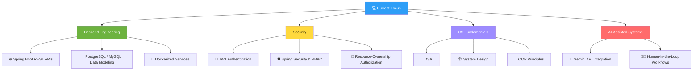
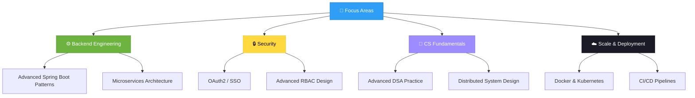

<div align="center">


# 👨‍💻 Ganning Joel

**Java Backend Developer** | Spring Boot · REST APIs · JWT Security · PostgreSQL · System Design

<a href="https://github.com/GanningJoel-05">
  
</a>

[](mailto:ganningjoel169@gmail.com)
[](https://github.com/GanningJoel-05)
[](https://www.linkedin.com/in/ganningjoelj1609)

<br>


</div>

---

<div align="center">

### 🧭 Quick Navigation

[📊 Stats](#-github-stats) · [👋 About](#-about-me) · [🛠️ Tech Stack](#️-tech-stack) · [💼 Experience](#-internship-experience) · [🚀 Projects](#-featured-projects) · [🏆 Leadership](#-leadership--achievements) · [📜 Certifications](#-certifications) · [🎓 Education](#-education) · [🗺️ Roadmap](#️-roadmap)

</div>

---

<div align="center">

</div>

## 📊 GitHub Stats

<div align="center">


<br>


<br>


</div>

---

## 🧩 LeetCode Progress

<div align="center">

[](https://leetcode.com/u/GanningJoelDev169/)

<sub>Live card — regenerates from my LeetCode profile on every page load, no manual updates needed.</sub>

</div>

---

<div align="center">

</div>

## 👋 About Me

```java
public class GanningJoel {

    private String name        = "Ganning Joel";
    private String role        = "Java Backend Developer";
    private String location    = "📍 Dindigul, Tamil Nadu, India";
    private String education   = "🎓 B.E. ECE, PSNA College of Engineering and Technology (CGPA: 8.42/10) | 2023–2027";
    private String internship  = "💼 Java Full Stack Developer Intern @ Vinsup Infotech (P) Ltd";

    private String[] focus = {
        "🔐 Scalable, secure REST APIs with Java & Spring Boot",
        "🛡️ JWT Authentication, Spring Security & Role-Based Access Control",
        "🗄️ Relational database design with MySQL & PostgreSQL",
        "🧠 DSA, OOP & System Design fundamentals",
        "🤖 AI-assisted backend workflows (Gemini API, HITL systems)"
    };

    private Map<String, String[]> stack = Map.of(
        "languages", new String[]{"Java", "SQL"},
        "backend",   new String[]{"Spring Boot", "Spring MVC", "Spring Data JPA", "Hibernate", "Spring Security"},
        "database",  new String[]{"MySQL", "PostgreSQL"},
        "tools",     new String[]{"Git", "Maven", "Postman", "Docker", "Swagger", "IntelliJ IDEA"}
    );

    private String[] learning  = {"Advanced System Design", "Cloud & Microservices", "Distributed Systems"};
    private String principle   = "Code · Build · Improve · Repeat";
    private String lookingFor  = "Java Backend Developer role at a product-based company";
}
```

---

<div align="center">

</div>

## 🛠️ Tech Stack

<div align="center">

<a href="https://skillicons.dev">
  
</a>

<br><br>

**Languages**


**Backend & APIs**


**Databases & DevOps**


**Core CS Fundamentals**


**Tools & Platforms**


**AI-Assisted Development**


</div>

---

<div align="center">

</div>

## 💼 Internship Experience

### 🏢 Java Full Stack Developer Intern — Vinsup Infotech (P) Ltd *(On-Site)*
**June 2025 – July 2025 · Madurai, Tamil Nadu, India**

- 🏗️ Architected and delivered scalable RESTful APIs using **Java, Spring Boot, Spring Data JPA, and PostgreSQL** for a Budget Management System — powering auth, transaction tracking, and real-time dashboard analytics.
- 🔐 Secured application backends with **Spring Security and BCrypt** password hashing, hardened CORS policies, normalized auth inputs to prevent login mismatches, and optimized Hibernate database mappings.
- 🤝 Collaborated within a **5-member Agile engineering team** using Git/GitHub, establishing API contracts and debugging frontend integration issues to ship end-to-end features on schedule.

---

<div align="center">

</div>

## 🚀 Featured Projects

### ⭐ Flagship: AI-Powered Ticket Management System (Human-in-the-Loop)

**FantomCode 2026** — *National-level 24-hour hackathon, 250+ teams, finalist as Team Lead.*

An AI-assisted IT service desk that pairs an LLM's triage speed with a human's final call — every AI suggestion is routed through an approval workflow before it touches a ticket.

- 🤖 **Automated ticket classification** — integrates the **Gemini 2.5 Flash API** for AI-generated solution suggestions on incoming tickets
- 🧑‍⚖️ **Human-in-the-Loop (HITL) approval workflows** — AI proposes, a human approves, nothing auto-resolves silently
- 🔐 **Role-Based Access Control** — USER / ADMIN roles gating who can approve, escalate, or close tickets
- 📊 **Real-time dashboard analytics** on ticket volume and resolution paths
- 🗄️ Backend built on **Spring Boot, PostgreSQL, and JWT authentication**

   

### 🌐 Backend Systems

| Project | Description | Tech | Live Demo | Source |
|---|---|---|---|---|
| 🍔 **Online Food Ordering System** | Multi-role backend enforcing two-layer authorization (RBAC + resource-ownership); deterministic order-lifecycle state machine rejecting invalid status transitions; optimistic locking (`@Version`) for concurrent menu edits; Dockerized PostgreSQL; auto-generated Swagger docs. |    | — | 🔒 Private |
| 📊 **[Budget Management System](https://github.com/GanningJoel-05/Budget-Management-System)** | Income, expense, savings, and budget-planning backend built during my Vinsup Infotech internship — secure user data handling, transaction tracking, real-time dashboard analytics, and optimized PostgreSQL queries. Backend by me; frontend dashboards by a teammate. |    | — | [Repo](https://github.com/GanningJoel-05/Budget-Management-System) |
| ⚙️ **Smart Queue Management System** *(Pure Backend)* | Hospital queue-management APIs for token generation, appointment handling, and queue-status tracking — built to demonstrate API design without any frontend dependency. Spring Data JPA + PostgreSQL + JWT + transactional workflows, optimized for real-time updates across departments. |   | — | 🔒 Private |
| 🎮 **[Java Quiz Game Application](https://github.com/GanningJoel-05/Java-Quiz-Game-Project)** | Console-based quiz game — real-time score tracking, leaderboard functionality, exception handling and input validation, clean OOP-first code. |  | — | [Repo](https://github.com/GanningJoel-05/Java-Quiz-Game-Project) |

<div align="center">

<a href="https://github.com/GanningJoel-05/Budget-Management-System">
  
</a>
<a href="https://github.com/GanningJoel-05/Java-Quiz-Game-Project">
  
</a>

</div>

### 💡 What I'm Building



---

<div align="center">

</div>

## 🏆 Leadership & Achievements

<table>
  <tr>
    <td width="50%" valign="top">
      <h3>🥇 Competitions</h3>
      - <strong>FantomCode 2026</strong> — National Hackathon Finalist, Team Lead (250+ teams)<br>
      - <strong>Coder Arena</strong> — Coding Competition Finalist<br>
      - <strong>PSNACET Coding Competition</strong> — 3rd Place (₹750 Prize)<br>
      - <strong>Zoho Cliqtrix 2025</strong> — AI-Powered Bot Building Contest Participant<br>
      - <strong>Paper Presentation Winner</strong> — AI-Powered Smart Pothole Detection System, PSNACET
    </td>
    <td width="50%" valign="top">
      <h3>⚙️ Roles & Badges</h3>
      - <strong>Technical Strategist Advisor</strong> — Robo Club, PSNACET<br>
      - <strong>Active Member</strong> — Build Club, PSNACET<br>
      - 🥇 <strong>HackerRank Gold Badge</strong> — SQL<br>
      - 🥈 <strong>HackerRank Silver Badge</strong> — Java
    </td>
  </tr>
</table>

---

<div align="center">

</div>

## 📜 Certifications

| Certification | Issuer |
|---|---|
| [SQL (Intermediate)](https://www.hackerrank.com/certificates/iframe/68caa5f6caf9) | HackerRank |
| [SQL (Basic)](https://www.hackerrank.com/certificates/iframe/c4f0014e00bf) | HackerRank |
| [Java (Basic)](https://www.hackerrank.com/certificates/iframe/7b0a1b59435c) | HackerRank |
| [Problem Solving (Basic)](https://www.hackerrank.com/certificates/iframe/429672573c9f) | HackerRank |
| Object-Oriented Programming (OOP) | TakeUForward |
| Claude Code 101 | Anthropic Academy |

---

<div align="center">

</div>

## 🎓 Education

**PSNA College of Engineering and Technology** | 2023 – 2027
B.E. Electronics and Communication Engineering — CGPA: 8.42/10 | Dindigul, Tamil Nadu, India

**St. Mary's Higher Secondary School** | 2022 – 2023
Higher Secondary Education (Class XII) — 89% | Dindigul, Tamil Nadu, India

---

<div align="center">

</div>

## 🗺️ Roadmap



---

<div align="center">

</div>

## 📦 Shipped So Far


---

<div align="center">


<br>

### 🌟 *"Code → Build → Improve → Repeat. Every line of code is a step closer to impact."*

<br>

### 🤝 Let's Build Something Reliable Together

[](mailto:ganningjoel169@gmail.com)
[](https://github.com/GanningJoel-05)
[](https://ganningjoel-portfolio.netlify.app/)
[](https://leetcode.com/u/GanningJoelDev169/)
[](https://auth.geeksforgeeks.org/user/j_joel_0549/)

<br>


**⭐️ From [GanningJoel-05](https://github.com/GanningJoel-05) — Made with 💙 in Markdown**


</div>
