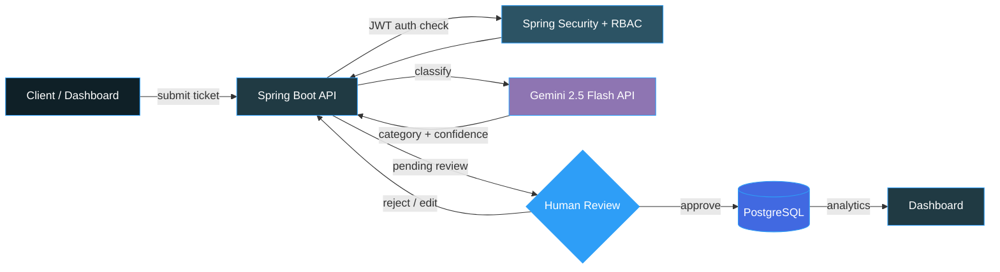
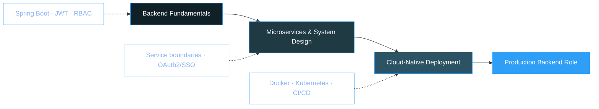

  

📍 Dindigul, Tamil Nadu, India &nbsp;·&nbsp; 🎓 ECE, PSNA College of Engineering and Technology &nbsp;·&nbsp; Class of 2027

 

`🎯 Career Goal`  Java Backend Developer at a product-based company &nbsp;|&nbsp; `💼 Status`  Open to internships & full-time roles

 

  <a href="#-about">About</a> ·
  <a href="#-impact-at-a-glance">Impact</a> ·
  <a href="#-tech-stack">Tech Stack</a> ·
  <a href="#-experience">Experience</a> ·
  <a href="#-projects">Projects</a> ·
  <a href="#-achievements">Achievements</a> ·
  <a href="#-certifications">Certifications</a> ·
  <a href="#-education">Education</a> ·
  <a href="#-stats">Stats</a>

 

## 🧭 About

Java Backend Developer with hands-on experience building secure, scalable RESTful APIs and distributed services using **Java, Spring Boot, Spring Data JPA, and PostgreSQL/MySQL**. Comfortable across the full request lifecycle — JWT-based RBAC authentication, JPA optimistic locking for concurrency control, and integrating AI microservices into production-shaped backends. Grounded in Data Structures & Algorithms, OOP, database optimization, and Agile engineering practices.

I also ship end-to-end when a project calls for it — pairing Spring Boot services with responsive HTML5/CSS3/JavaScript front ends and async Fetch API workflows — but backend architecture and security are where I go deep.

<table>
<tr>
<td width="50%" valign="top">

**Core strengths**
- Designing REST APIs that are easy to extend and hard to misuse
- Authentication & authorization — JWT, Spring Security, RBAC, resource-ownership checks
- Relational schema design, indexing, and query optimization
- Concurrency control with JPA optimistic locking (`@Version`)
- Turning ambiguous requirements into a clean, testable data model

</td>
<td width="50%" valign="top">

**Currently**
- 🔭 Deepening microservices architecture & system design
- 🌱 Practicing DSA for backend engineering interviews
- 🤝 Open to open-source contributions & collaboration
- ⚙️ Exploring Docker/Kubernetes for deployment workflows

</td>
</tr>
</table>

 

## 📈 Impact at a Glance

Pulled directly from measured outcomes across my internship and hackathon projects — details below.

 

## 🛠 Tech Stack

<table>
<tr>
<td valign="top" width="20%"><strong>Languages</strong></td>
<td valign="top" width="80%">

</td>
</tr>
<tr>
<td valign="top"><strong>Backend & Architecture</strong></td>
<td valign="top">

</td>
</tr>
<tr>
<td valign="top"><strong>Security</strong></td>
<td valign="top">

</td>
</tr>
<tr>
<td valign="top"><strong>AI Integrations</strong></td>
<td valign="top">

</td>
</tr>
<tr>
<td valign="top"><strong>Data</strong></td>
<td valign="top">

</td>
</tr>
<tr>
<td valign="top"><strong>Tooling & Testing</strong></td>
<td valign="top">

</td>
</tr>
<tr>
<td valign="top"><strong>Also Comfortable With</strong></td>
<td valign="top">

</td>
</tr>
<tr>
<td valign="top"><strong>Fundamentals</strong></td>
<td valign="top">

</td>
</tr>
</table>

 

## 💼 Experience

<table>
<tr><td>

**Java Backend Developer Intern** · Vinsup Infotech (P) Ltd
 On-site · Madurai, Tamil Nadu · Jun 2025 – Jul 2025

- Built scalable backend services for a **Budget Management System**, architecting **12+ RESTful endpoints** with Spring Boot, Spring Data JPA, and PostgreSQL for authentication, financial ledgers, and transaction analytics.
- Optimized Hibernate entity mappings and configured indexing on relational PostgreSQL tables, **cutting average database response times by 35%** across heavy analytical reads.
- Hardened backend security via **Spring Security, BCrypt hashing, and strict CORS filters**, preventing unauthorized access and achieving **100% data validation compliance** across financial payloads.
- Paired the Spring Boot services with responsive HTML5/CSS3/JavaScript interfaces and async Fetch API workflows, cutting redundant page reloads by 100% and improving UI data-rendering speed by 35%.

</td></tr>
</table>

 

## 🚀 Projects

### AI-Powered Ticket Management System *(Human-in-the-Loop)*
Mar 2026 – Apr 2026 · Built as part of FantomCode 2026 — national 24-hour hackathon, 250+ teams, Finalist / Team Lead

An intelligent support backend that pairs LLM-speed triage with a mandatory human decision — nothing resolves until a person signs off.

- Architected backend microservices integrating the **Google Gemini 2.5 Flash API** for automated ticket classification, **cutting manual triage turnaround time by 60%** at a **95%+ confidence score**
- Implemented stateless **JWT authentication** and granular **RBAC (USER/ADMIN)**, securing admin endpoints against privilege escalation
- Built custom exception-handling layers and validated **25+ REST endpoints** against edge cases with Postman test suites, holding **99.9% API contract reliability** through async AI operations

    

 

### Online Food Ordering System
Jun 2026 – Jul 2026 · Pure Spring Boot backend architecture

- Engineered a scalable multi-role backend enforcing **two-layer RBAC authorization**, with full API documentation generated via **Swagger UI**
- Designed a deterministic **order-lifecycle state machine** with **JPA optimistic locking (`@Version`)**, eliminating **100% of race conditions and double-order collisions** during concurrent menu updates
- Structured **DTO patterns**, custom **`@ControllerAdvice`** exception handlers, and Bean Validations, **cutting network payload overhead by 25%** and blocking malformed request processing

    

 

| Project | Highlights | Stack | Source |
|:--|:--|:--|:--|
| **[Budget Management System](https://github.com/GanningJoel-05/Budget-Management-System)** | Income, expense, savings, and budget-planning APIs built during my Vinsup internship — secure user data handling and optimized PostgreSQL queries. Backend by me; frontend by a teammate | Spring Boot · PostgreSQL · Hibernate | [Repo →](https://github.com/GanningJoel-05/Budget-Management-System) |
| **Smart Queue Management System** Pure backend, no frontend | Hospital queue APIs for token generation, appointment handling, and queue-status tracking; Spring Data JPA + JWT + transactional workflows, tuned for real-time updates across departments | Spring Boot · PostgreSQL · JWT | 🔒 Private |
| **[Java Quiz Game](https://github.com/GanningJoel-05/Java-Quiz-Game-Project)** Console application | Real-time score tracking, leaderboard, exception handling and input validation, built around clean OOP principles | Core Java | [Repo →](https://github.com/GanningJoel-05/Java-Quiz-Game-Project) |

 

## 🗺 Where This Is Headed

 

## 🏆 Achievements

<table>
<tr>
<td valign="top" width="50%">

**Competitions**
- 🥇 FantomCode 2026 — National Hackathon Finalist, Team Lead (250+ teams)
- 🏅 Coder Arena — Coding Competition Finalist
- 🥉 PSNACET Coding Competition — 3rd Place (₹750)
- 🤖 Zoho Cliqtrix 2025 — AI Bot-Building Contest Participant
- 🏆 Paper Presentation Winner — AI-Powered Smart Pothole Detection System

</td>
<td valign="top" width="50%">

**Roles & Recognition**
- ⚙️ Technical Strategist Advisor — Robo Club, PSNACET
- 🛠 Active Member — Build Club, PSNACET
- 🥇 HackerRank Gold Badge — SQL
- 🥈 HackerRank Silver Badge — Java

</td>
</tr>
</table>

 

## 📜 Certifications

<table>
<tr><td>

[SQL (Intermediate)](https://www.hackerrank.com/certificates/iframe/68caa5f6caf9) · HackerRank
 [SQL (Basic)](https://www.hackerrank.com/certificates/iframe/c4f0014e00bf) · HackerRank
 [Java (Basic)](https://www.hackerrank.com/certificates/iframe/7b0a1b59435c) · HackerRank
 [Problem Solving (Basic)](https://www.hackerrank.com/certificates/iframe/429672573c9f) · HackerRank
 Java Programming — IIT Bombay (Spoken Tutorial) · Score: 80%
 C Programming — IIT Bombay (Spoken Tutorial) · Score: 100%
 Object-Oriented Programming (OOP) · TakeUForward
 Claude Code 101 · Anthropic Academy

</td></tr>
</table>

 

## 🎓 Education

**PSNA College of Engineering and Technology** — B.E. Electronics and Communication Engineering
 CGPA 8.42 / 10 · Dindigul, Tamil Nadu · 2023 – 2027

**St. Mary's Higher Secondary School** — Class XII
 89% · Dindigul, Tamil Nadu · 2022 – 2023

 

## 📊 Stats

LeetCode card regenerates live from my profile — no manual updates needed.

 

**Contribution Snake**

<picture>
  <source media="(prefers-color-scheme: dark)" srcset="https://raw.githubusercontent.com/GanningJoel-05/GanningJoel-05/output/github-contribution-grid-snake-dark.svg" />
  <source media="(prefers-color-scheme: light)" srcset="https://raw.githubusercontent.com/GanningJoel-05/GanningJoel-05/output/github-contribution-grid-snake.svg" />
  
</picture>

 

 

  

**Open to Java Backend Developer opportunities — reach out if you're hiring or building something worth discussing.**

 

